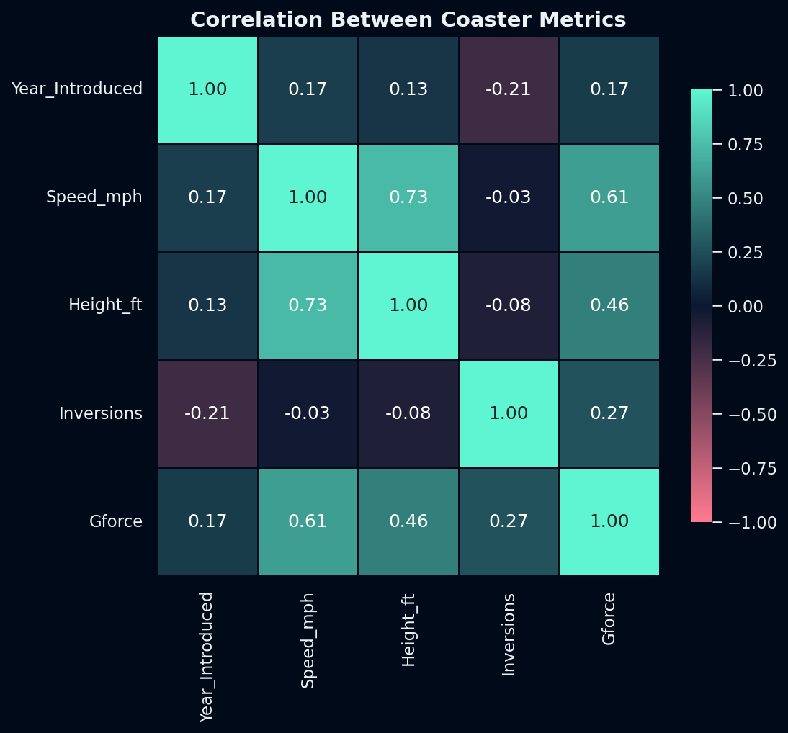

# 🎢 Roller Coaster Database — Exploratory Data Analysis

An EDA on 1,087 roller coasters worldwide (historic and modern): how coaster speed, height, inversions and G-force relate to each other, how many coasters were introduced each year, and a data-cleaning bug that was silently deleting real coasters.



## Key points

1. **A duplicate-removal bug was deleting real coasters.** The original check matched rows on `Coaster_Name` + `Location` + `Opening_Date`. Many rows fall back to `Location = "Other"` with no `Opening_Date`, so two *different* coasters that just share a name — e.g. **Batman: The Ride**, a Bolliger & Mabillard model built at several different Six Flags parks — looked identical on those three columns and got collapsed into one. That silently dropped **66 real coasters** (only 1 of 4 "Big Thunder Mountain Railroad" installations survived the original logic). The fix only treats rows as duplicates when they agree on a *known* location and date, recovering those coasters (1,087 → 1,060 after only the genuine duplicates are removed, instead of 990).
2. **Speed and height are closely linked** (r = 0.73): taller coasters are consistently faster. G-force tracks both (r = 0.61 with speed, 0.46 with height).
3. **More inversions goes with slightly older coasters** (r = −0.21 with year introduced) and has almost no relationship with speed (r = −0.03) — loopy coasters aren't necessarily fast ones.
4. **1999 and 2000 were the biggest years** for new coasters in the dataset (49 and 47), part of a construction boom in the late 1990s/early 2000s visible in the "Top 10 Years" chart.
5. **The correlation numbers rest on a small, non-representative slice.** Only 68 of 1,060 coasters (6%) have speed, height, inversions *and* G-force all recorded — `Height_ft` alone is missing for 894 of them, mostly older wood coasters that were never measured that way. Treat the correlation matrix and pairplot as a rough signal, not a precise estimate.

## What the notebook does

1. **Load & inspect** — shape, dtypes, `describe()`, missing values.
2. **Clean & prepare** — select the relevant columns, parse the opening date, rename columns to a consistent style.
3. **Remove duplicate coasters** — the corrected logic described above.
4. **Univariate analysis** — coasters introduced per year, speed distribution.
5. **Bivariate & multivariate analysis** — speed vs. height (plain and coloured by year introduced), a pairplot by coaster type (Steel / Wood / Other).
6. **Correlation** — a missing-value check on the numeric columns, then the correlation matrix and heatmap.

## Repository structure

```
.
├── roller_coaster_eda.ipynb   # the full analysis (executed, outputs included)
├── data/
│   └── coaster_db.csv         # roller coaster dataset
├── images/                    # figures exported by the notebook
├── requirements.txt
└── README.md
```

## Run it yourself

```bash
git clone https://github.com/<your-username>/roller-coaster-eda.git
cd roller-coaster-eda

python -m venv .venv
source .venv/bin/activate        # Windows: .venv\Scripts\activate
pip install -r requirements.txt

jupyter lab roller_coaster_eda.ipynb
```

Run the notebook from the repository root: it reads `data/coaster_db.csv` and writes its figures to `images/`.

**Tested with** Python 3.12, pandas 3.0, numpy 2.4, matplotlib 3.10, seaborn 0.13.

## Data

- **File:** `coaster_db.csv` — 1,087 roller coasters with 56 columns covering specs (speed, height, inversions, G-force), location, manufacturer, and dates, including some pre-cleaned numeric columns (`speed_mph`, `height_ft`, `Inversions_clean`, `Gforce_clean`, `opening_date_clean`) alongside the original text fields.
- **Ownership:** included here (about 450 KB) only so the notebook runs out of the box; it belongs to its original source.

## Limitations

`Height_ft` and `Gforce` are missing for most coasters (84% and 67% respectively), so any statistic that needs both is based on a small, likely-biased subset (mostly newer, more thoroughly documented coasters). `Status` contains inconsistent free-text values (not used in this notebook, but worth cleaning before analyzing ride status). Correlation is not causation, and every coaster counts once regardless of how well-known or how long it operated.

## Possible next steps

- Clean the `Status` column into consistent categories and look at operating vs. removed coasters.
- Bring in `Manufacturer` and `Park section` for a builder- or park-level comparison.
- Model `Speed_mph` from height, inversions and year introduced.

## About

**Author:** [Mahmoud H. A. Abu Saada](https://www.linkedin.com/in/ds-ai-mahmoud-abu-saada) · [GitHub](https://github.com/DS-mhas2007)
